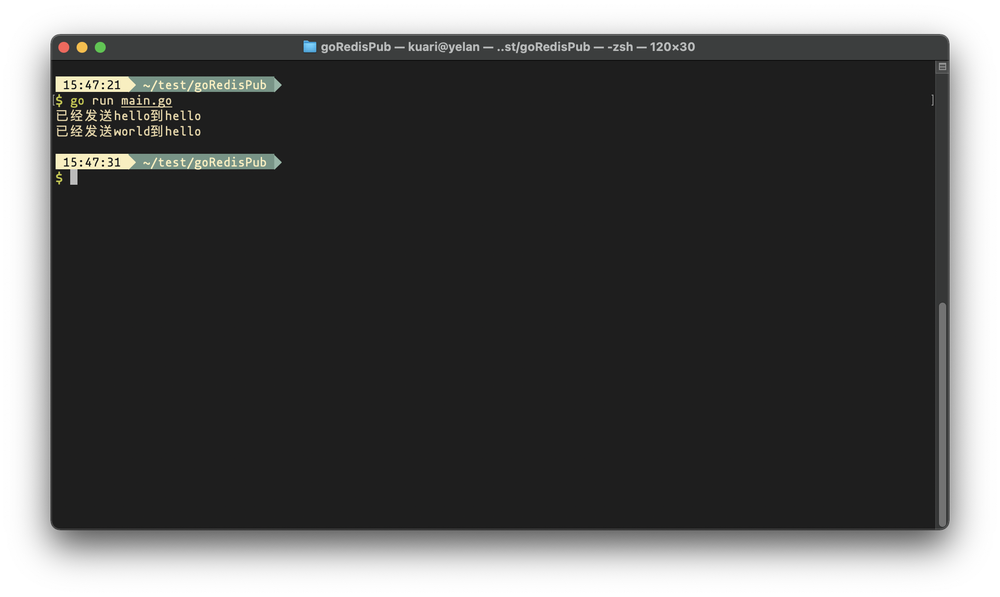
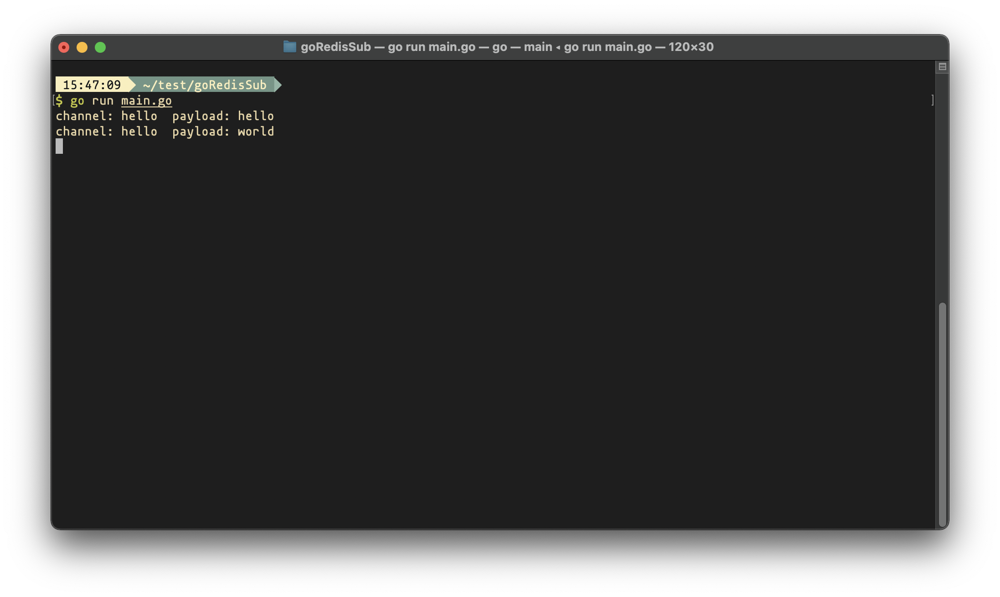

## 一. 前言

在数据量较小的情况下，可以使用`Redis`来实现消息的发布与订阅，来代替`Kafka`。`Kafka`对于数据量大的场景下性能卓越，但是对于如此小场景时候，不仅运维成本提升，还用不上多少性能。

不过使用`Redis`的另一个弊端是消息不能堆积，一旦消费者节点没有消费消息，消息将会丢失。因此需要评估当下场景来选择适合的架构。

此处使用go-redis来实现`Redis`的发布与订阅。


## 二. 官方文档

[官方文档](https://pkg.go.dev/github.com/go-redis/redis/v8#PubSub)有较为完整的例子：

```go
pubsub := rdb.Subscribe(ctx, "mychannel1")

// Wait for confirmation that subscription is created before publishing anything.
_, err := pubsub.Receive(ctx)
if err != nil {
	panic(err)
}

// Go channel which receives messages.
ch := pubsub.Channel()

// Publish a message.
err = rdb.Publish(ctx, "mychannel1", "hello").Err()
if err != nil {
	panic(err)
}

time.AfterFunc(time.Second, func() {
	// When pubsub is closed channel is closed too.
	_ = pubsub.Close()
})

// Consume messages.
for msg := range ch {
	fmt.Println(msg.Channel, msg.Payload)
}
```


## 三. 代码实现

分步讲解下具体实现代码。

### 1. 连接redis

```go
func redisConnect() (rdb *redis.Client) {

	var (
		redisServer string
		port        string
		password    string
	)

	redisServer = os.Getenv("RedisUrl")
	port = os.Getenv("RedisPort")
	password = os.Getenv("RedisPass")

	rdb = redis.NewClient(&redis.Options{
		Addr:     redisServer + ":" + port,
		Password: password,
		DB:       0, // use default DB
	})

	return
}
```


### 2. 发布消息

```go
func pubMessage(channel, msg string) {
	rdb := redisConnect()
	rdb.Publish(context.Background(), channel, msg)
}
```


### 3. 订阅消息

```go
func subMessage(channel string) {
	rdb := redisConnect()
	pubsub := rdb.Subscribe(context.Background(), channel)
	_, err := pubsub.Receive(context.Background())
	if err != nil {
		panic(err)
	}

	ch := pubsub.Channel()
	for msg := range ch {
		fmt.Println(msg.Channel, msg.Payload)
	}
}
```


## 四. 完整案例

此处分为一个发布节点和一个订阅节点来实现了简单的发布与订阅。

### 1. 消息发布节点

```go
package main

import (
	"context"
	"fmt"
	"os"

	"github.com/go-redis/redis/v8"
)

func redisConnect() (rdb *redis.Client) {

	var (
		redisServer string
		port        string
		password    string
	)

	redisServer = os.Getenv("RedisUrl")
	port = os.Getenv("RedisPort")
	password = os.Getenv("RedisPass")

	rdb = redis.NewClient(&redis.Options{
		Addr:     redisServer + ":" + port,
		Password: password,
		DB:       0, // use default DB
	})

	return
}

func pubMessage(channel, msg string) {
	rdb := redisConnect()
	rdb.Publish(context.Background(), channel, msg)
}

func main() {
	channel := "hello"
	msgList := []string{"hello", "world"}

  // 此处发了两个消息
	for _, msg := range msgList {
		pubMessage(channel, msg)
		fmt.Printf("已经发送%s到%s\n", msg, channel)
	}
}
```


### 2. 消息订阅节点

```go
package main

import (
	"context"
	"fmt"
	"os"

	"github.com/go-redis/redis/v8"
)

func redisConnect() (rdb *redis.Client) {

	var (
		redisServer string
		port        string
		password    string
	)

	redisServer = os.Getenv("RedisUrl")
	port = os.Getenv("RedisPort")
	password = os.Getenv("RedisPass")

	rdb = redis.NewClient(&redis.Options{
		Addr:     redisServer + ":" + port,
		Password: password,
		DB:       0, // use default DB
	})

	return
}

func subMessage(channel string) {
	rdb := redisConnect()
	pubsub := rdb.Subscribe(context.Background(), channel)
	_, err := pubsub.Receive(context.Background())
	if err != nil {
		panic(err)
	}

	ch := pubsub.Channel()
	for msg := range ch {
		fmt.Println(msg.Channel, msg.Payload)
	}
}

func main() {
    channel := "hello"
    subMessage(channel)
}

```


## 五. 运行结果

### 1. 消息发布节点输出



### 2. 消息订阅节点输出

