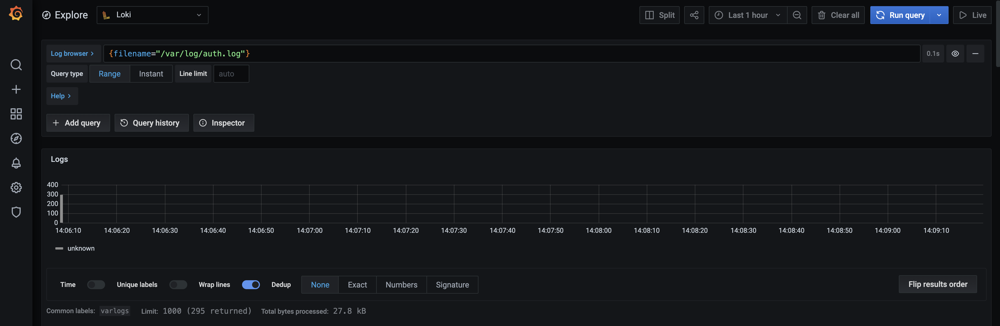
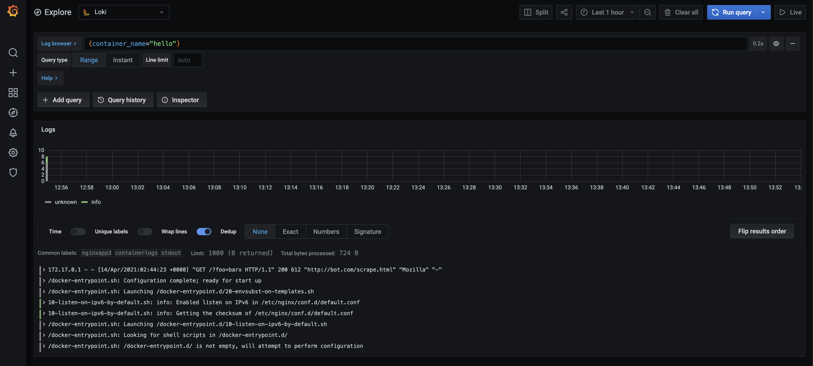

## 一. 前言

### 1. 简介

`Grafana`项目由TorkelÖdegaard于2014年发起，最近几年成为GitHub上最受欢迎的开源项目之一。 它使您可以查询，可视化指标并记录警报，无论它们存储在何处。

`Loki`是受Prometheus启发的水平可扩展，高度可用的多租户日志聚合系统。 它被设计为非常经济高效且易于操作。 它不索引日志的内容，而是为每个日志流设置一组标签。

`Promtail`是将本地日志内容发送到私有Loki实例或Grafana Cloud的代理。 通常将其部署到需要监视应用程序的每台机器上。

### 2. 方案对比

为什么选择`Grafana` + `Loki` + `Promtail`的日志采集方案呢？

我尝试过如下几种方案：

* `Elasticsearch`+`Kibana`+`Filebeat`： 运维成本低，侵入性低，但是对于高并发情况下效果不太好，消耗资源也稍高，需要考虑日志存储成本
* `Elasticsearch`+`Kibana`+`Logstash`+`Kafka`+`Filebeat`: 可以有效处理高并发情况，且在`elk`节点挂掉情况下不会丢失日志。但是，运维成本高，需要考虑日志存储成本，整套消耗资源比较高！
* `Grafana`+`Loki`+`Docker Driver Client`：使用Docker Driver的方式来直接获取容器的日志，配置较简单，但是需要物理机上安装docker plugin，和运行容器时设置`log-driver`，侵入性较高

相比之下，当前选择的方案，对于我们当前业务场景下是较为合适的，轻量且侵入性低，由于是检测日志文件，无需担心存储成本。


## 二. 通用日志收集

首先介绍下通用日志收集版本的部署。只需要使用默认配置即可收集普通日志，可在`http://<your-ip>:3000`上查看日志详情。

### 1. docker-compose

```yaml
version: "3"

networks:
  loki:

services:
  loki:
    image: grafana/loki:2.0.0
    ports:
      - "3100:3100"
    command: -config.file=/etc/loki/local-config.yaml
    networks:
      - loki

  promtail:
    image: grafana/promtail:2.0.0
    volumes:
      - /var/log:/var/log
    command: -config.file=/etc/promtail/config.yml
    networks:
      - loki

  grafana:
    image: grafana/grafana:latest
    ports:
      - "3000:3000"
    networks:
      - loki
```

### 2. 添加数据源

部署成功之后，打开`http://<your-ip>:3000`访问`Grafana`，在左侧菜单栏选择`Configuration`，默认进去`Data Sources`页面。

点击`Add data sources`按钮，选择`Loki`。


填入`URL`即可，此处为`http://loki:3100`，具体要看实际部署。


然后点击`Sace & Test`添加。

### 3. 查看与筛选日志

在左侧菜单栏选择`Explore`进入页面，点击左上角的`Log brwser`按钮，可以查看该数据源的`labels`，如此处为日志文件。


在页面顶部的输入框中输入官方的`LogQL`可以筛选日志。此处日志就不展示了，大家知道有就行了。




## 三. Docker容器日志收集

此处详细介绍下关于docker容器日志收集。

### 1. promtail配置文件

```yaml
# promtail.config.yaml
server:
  http_listen_address: 0.0.0.0
  http_listen_port: 9080

positions:
  filename: /tmp/positions.yaml

clients:
  - url: http://loki:3100/loki/api/v1/push

scrape_configs:
- job_name: containers
  static_configs:
  - targets:
      - localhost
    labels:
      job: containerlogs
      __path__: /var/lib/docker/containers/*/*log

  pipeline_stages:
  - json:
      expressions:
        output: log
        stream: stream
        attrs:
  - json:
      expressions:
        tag:
      source: attrs
  - regex:
      expression: (?P<container_name>(?:[^|]*[^|]))
      source: "tag"
  - timestamp:
      format: RFC3339Nano
      source: time
  - labels:
      # tag:
      stream:
      container_name:
  - output:
      source: output
```

### 2. docker-compose

```yaml
version: "3"

networks:
  loki:

services:
  loki:
    image: grafana/loki:2.0.0
    ports:
      - "3100:3100"
    command: -config.file=/etc/loki/local-config.yaml
    networks:
      - loki

  promtail:
    image: grafana/promtail:2.0.0
    volumes:
      - /var/lib/docker/containers:/var/lib/docker/containers
      - ./promtail-config.yaml:/mnt/config/promtail-config.yaml
    command: -config.file=/mnt/config/promtail-config.yaml
    networks:
      - loki

  grafana:
    image: grafana/grafana:latest
    ports:
      - "3000:3000"
    networks:
      - loki
```

### 3. 容器日志展现形式

至此其实就已经可以在`Grafana`上看到当前容器的日志了，操作如上`通用日志采集`，但是其展现形式只是`filename`，也就是类似于`107728869f40afa5510879a0e372c77bb513d6154591193d375bfcd421357ed4.log`的以container_id展现的日志文件，难以辨认具体是哪个容器。（要是有功夫去登录服务器看下容器id，不如直接看下日志了...）

所以，为了能够使用容器名去查看日志，此处需要在容器启动时设置参数：

```shell
--log-driver json-file --log-opt tag="{{.Name}}"
```

举个例子：

```shell
docker run --name hello -p 8080:80 --log-driver json-file --log-opt tag="{{.Name}}" -d nginx
```



对于使用container name，还有[另一种方案](https://github.com/grafana/loki/issues/333)，就是每次生成container_name和container_id的映射表，个人认为比较麻烦，有兴趣的小伙伴儿可以尝试下。


## 三. 参考文档

* [Loki官方文档](https://grafana.com/docs/loki/latest/)
* [ruanbekker/promtail_docker_logs](https://gist.github.com/ruanbekker/c6fa9bc6882e6f324b4319c5e3622460)
* [Display docker logs with human/logical name](https://github.com/grafana/loki/issues/333)