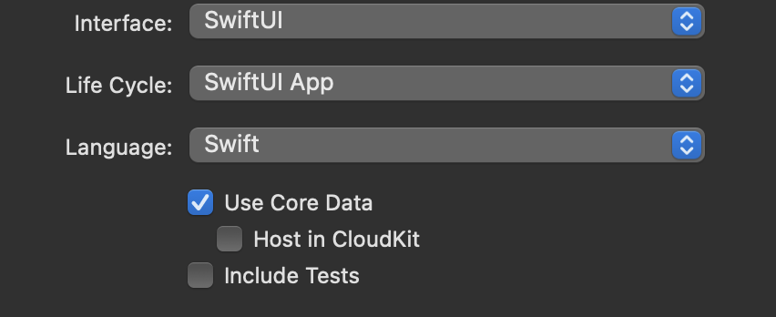
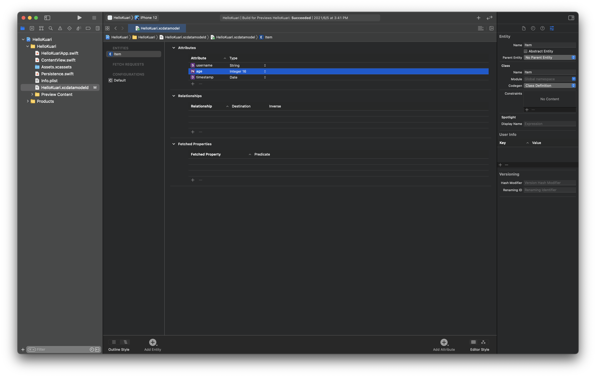
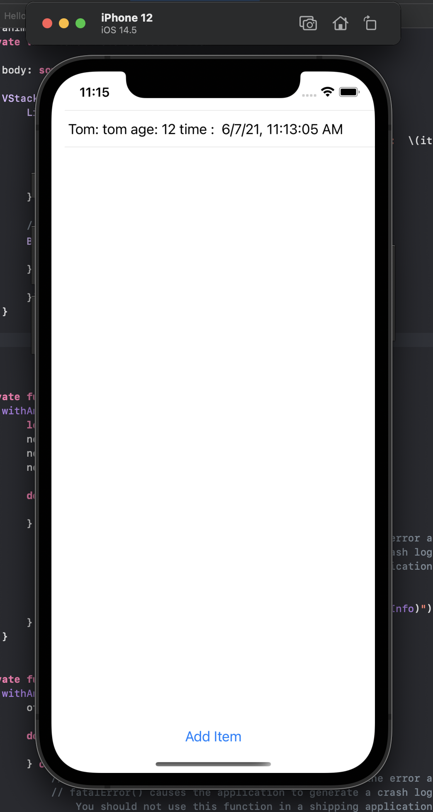

## 一. 前言

这篇文章是我写的第一篇Swift UI相关的笔记吧。

这真的难搞哦，毕竟新出来的。国内文档真的是少之又少，国外的文档也真不多，基本搜出来的都是UIKit的。官方文档，也是一言难尽，基本就处于，我要实现一个功能，然后去搜一下各种帖子，筛选掉无用的帖子，找到有用的点，当然也是时常根本找不到有用的帖子，然后就要去油管上看各种教程，然后发现：哦！原来还有这个方法！接着去官方文档搜一下，看一下属性，自己调用调用......

光是这个core data我就折腾了近一周，最后发现，原来还是官方好呀.....

吐槽一下自学swift ui，现在进入正题了。

core data呢，是苹果官方的本地数据库，但是其存储的文件其实是`sqlite`文件。其可以通过icloud实现备份和同步，当然icloud我会额外写一篇文档来详细讲述的（又是一把辛酸泪...）。


## 二. 环境

如下是我当前的环境：

* 系统：macOS Big Sur 11.4
* Xcode：Version 12.5 (12E262)
* Swift：5.4


## 三. 操作步骤

### 1. 创建项目

在创建项目的时候，可以直接选择`Use Core Data`选项，xcode会直接在`ContentView.swift`中生成一个相关demo。




### 2. 查看相关文件

创建之后，查看文件目录，相对于不选择`Use Core Data`，会多出如下几个文件：

* <Your-Project-Name>.xcdatamodeId
* Persistence.swift


### 3. 创建core data表

点击`<Your-Project-Name>.xcdatamodeId`文件，进入页面。

可以看到页面内有默认的`CONFIGURATIONS`为`Default`，默认的`ENITITIES`为`Item`，可以理解为分别对应sql中的库和表。


然后点击`Item`，可以看到其字段，有默认的`timestamp`字段。

若要新增`ENTITIES`（表），点击底部的`Add Entity`按钮即可。

若要新增`Attributes`（字段），点击右侧`Attributes`中的`+`即可，注意字段要选择类型。

比如，此处以默认的`Item`为例，新增`username`和`age`两个字段。




### 4. 代码层面操作core data

#### 1）查看

```swift
@Environment(\.managedObjectContext) private var viewContext

@FetchRequest(
  sortDescriptors: [NSSortDescriptor(keyPath: \Item.timestamp, ascending: true)],
  animation: .default)
private var items: FetchedResults<Item>

// body中便利items即可
```

#### 2）新增

```swift
private func addItem() {
  withAnimation {
    let newItem = Item(context: viewContext)
    newItem.timestamp = Date()

    do {
      try viewContext.save()
    } catch {
      // Replace this implementation with code to handle the error appropriately.
      // fatalError() causes the application to generate a crash log and terminate. You should not use this function in a shipping application, although it may be useful during development.
      let nsError = error as NSError
      fatalError("Unresolved error \(nsError), \(nsError.userInfo)")
    }
  }
}
```

如上是xcode自动生成的新增函数，若是要自定义添加字段可以这样改动下：

```swift
// 此处按照如上添加Attributes修改，具体修改按照项目具体情况
private func addItem(username: String, age: Int16) {
  withAnimation {
    let newItem = Item(context: viewContext)
    newItem.username = username
    newItem.age = age
    newItem.timestamp = Date()

    do {
      try viewContext.save()
    } catch {
      // Replace this implementation with code to handle the error appropriately.
      // fatalError() causes the application to generate a crash log and terminate. You should not use this function in a shipping application, although it may be useful during development.
      let nsError = error as NSError
      fatalError("Unresolved error \(nsError), \(nsError.userInfo)")
    }
  }
}
```

#### 3）删除

```swift
private func deleteItems(offsets: IndexSet) {
  withAnimation {
    offsets.map { items[$0] }.forEach(viewContext.delete)

    do {
      try viewContext.save()
    } catch {
      // Replace this implementation with code to handle the error appropriately.
      // fatalError() causes the application to generate a crash log and terminate. You should not use this function in a shipping application, although it may be useful during development.
      let nsError = error as NSError
      fatalError("Unresolved error \(nsError), \(nsError.userInfo)")
    }
  }
}
```

#### 4）汇总

在默认生成代码中，有一个`toolbar`，其在`macos`中可以生效，但是在`ios`中只有`EditionButton()`可以使用，为了方便演示，此处新增一个`Button`来添加数据。

其次有点要声明下，在xcode中写代码时，右侧的`canvas`会实时渲染，列表中出现的数据并不是`core data`中的数据，而是默认生成的`Persistence.swift`中生成的演示数据，只能看看，不能当真。只有在模拟器/实体机编译运行时才能操作`core data`。

如下为修改过后的`ContentView.swift`文件：

```swift
//
//  ContentView.swift
//  HelloKuari
//
//  Created by Kuari on 2021/6/5.
//

import SwiftUI
import CoreData

struct ContentView: View {
    @Environment(\.managedObjectContext) private var viewContext

    @FetchRequest(
        sortDescriptors: [NSSortDescriptor(keyPath: \Item.timestamp, ascending: true)],
        animation: .default)
    private var items: FetchedResults<Item>

    var body: some View {
        
        VStack {
            List {
                ForEach(items) { item in
                    Text("Tom: \(item.username!) age: \(item.age) time :  \(item.timestamp!, formatter: itemFormatter)")
                }
                .onDelete(perform: deleteItems)
            }
            
            // 新增一个按钮来添加数据
            Button(action: {
                addItem(username: "tom", age: 12)
            }, label: {
                Text("Add Item")
            })
        }

    }

    private func addItem(username: String, age: Int16) {
        withAnimation {
            let newItem = Item(context: viewContext)
            newItem.username = username
            newItem.age = age
            newItem.timestamp = Date()

            do {
                try viewContext.save()
            } catch {
                // Replace this implementation with code to handle the error appropriately.
                // fatalError() causes the application to generate a crash log and terminate. You should not use this function in a shipping application, although it may be useful during development.
                let nsError = error as NSError
                fatalError("Unresolved error \(nsError), \(nsError.userInfo)")
            }
        }
    }

    private func deleteItems(offsets: IndexSet) {
        withAnimation {
            offsets.map { items[$0] }.forEach(viewContext.delete)

            do {
                try viewContext.save()
            } catch {
                // Replace this implementation with code to handle the error appropriately.
                // fatalError() causes the application to generate a crash log and terminate. You should not use this function in a shipping application, although it may be useful during development.
                let nsError = error as NSError
                fatalError("Unresolved error \(nsError), \(nsError.userInfo)")
            }
        }
    }
}

private let itemFormatter: DateFormatter = {
    let formatter = DateFormatter()
    formatter.dateStyle = .short
    formatter.timeStyle = .medium
    return formatter
}()

struct ContentView_Previews: PreviewProvider {
    static var previews: some View {
        ContentView().environment(\.managedObjectContext, PersistenceController.preview.container.viewContext)
    }
}
```

然后点击左侧顶部的运行按钮，编译运行。

一开始是空白一片，点击`Add Item`按钮之后，便会开始添加数据。



对于记录右滑即可删除，其为`List`的`onDelete`方法。


## 四. 结语

该文章是面向新手的，也是记录下我踩过的坑，因为目前文档匮乏，身边也没swift的开发小伙伴儿，只能靠自己摸索，若有大佬有更好的方法，真的还请不吝赐教。

后面持续记录踩坑中......


