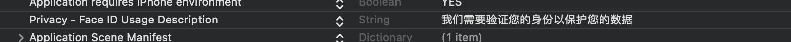

## 一. 设置权限

打开文件`info.plist`，在空白处右击，选择`Add Row`，输入选择`Privacy - Face ID Usage Description`，然后在`value`中写入`我们需要验证您的身份以保护数据`。




## 二. 代码层面接入

打开`ContentView.swift`文件，开始如下操作。

### 1. 引入相关库

```swift
import LocalAuthentication
```


### 2. 创建lock变量

```swift
@State private var isUnlocked = false
```

`isUnlocked`为是否解锁，`true`表示验证完成，已解锁，`false`表示验证失败，未解锁。


### 3. 创建函数

```swift
func authenticate() {
    let context = LAContext()
    var error: NSError?

    // 检查生物特征认证是否可用
    if context.canEvaluatePolicy(.deviceOwnerAuthenticationWithBiometrics, error: &error) {
        // 可用，所以继续使用它
        let reason = "我们需要验证您的身份以保护数据"

        context.evaluatePolicy(.deviceOwnerAuthenticationWithBiometrics, localizedReason: reason) { success, authenticationError in
            // 身份验证现已完成
            DispatchQueue.main.async {
                if success {
                    // 认证成功，解锁
                    self.isUnlocked = true
                } else {
                    // 发生的异常
                }
            }
        }
    } else {
        // 没有生物识别
    }
}
```


### 4. 根据isUnlocked切换View

```swift
VStack {
    if self.isUnlocked {
        Text("Unlocked")
    } else {
        Text("Locked")
    }
}
.onAppear(perform: authenticate) // 该方法调用生物识别验证函数
```


## 三. 审核问题

最近提交了ios和macos两个产品到app store，我设置的强制使用生物识别才能进入应用。但是出现的问题是macos的审核过了，而ios的审核没有过，其反馈的问题即为开始的生物识别没有过，审核人员使用的模拟器，根本不存在生物识别。

所以跟可能会踩这个坑的小伙伴儿提个醒，目前我还没有好的解决方案，正在等待新的审核中......


