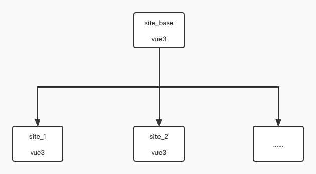
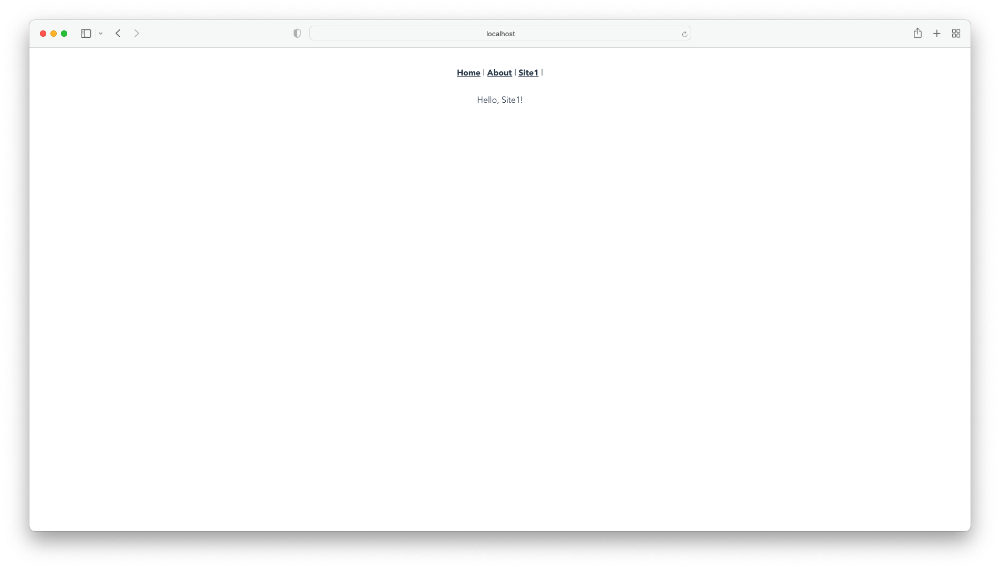

## 一. 前言

基于架构的调整，前端开始转为微前端。经过调研，决定使用[qiankun](https://qiankun.umijs.org/zh/guide/getting-started)微服务框架来使用，本文将介绍VUE3+TS+qiankun的实践经过。微服务架构的优势之一在于可以结合不同技术栈的节点，基于技术栈的考虑，此处用的都是vue3。


源码：[https://github.com/Kuari/Blog/tree/master/Examples/microFrontend](https://github.com/Kuari/Blog/tree/master/Examples/microFrontend)


## 二. 环境

* vue 3.0.0
* TypeScript 4.1.5
* vue router 4.0.0
* @vue/cli 4.5.15
* qiankun 2.6.3


## 三. 实践

### 1. 架构



如上图所示，微服务架构将会由多个节点构成，首先由一个主节点`site_base`连接所有子节点，子节点可以不断拓展。


### 2. 主节点

主节点源码可见于[https://github.com/Kuari/Blog/tree/master/Examples/microFrontend/site_base](https://github.com/Kuari/Blog/tree/master/Examples/microFrontend/site_base)

创建主节点，选择vue3+ts

```bash
vue create site_base
cd site_base
```

安装`qiankun`

```bash
yarn add qiankun
```

在`src/App.vue`中添加路由和渲染节点

```html
<template>
  <div id="nav">
    <router-link to="/">Home</router-link> |
    <router-link to="/about">About</router-link> |
    <!-- 新增site1路由 -->
    <router-link to="/site1">Site1</router-link> |
    <!-- 新增site2路由 -->
    <router-link to="/site2">Site2</router-link>
  </div>
  <router-view/>
  <!-- 新增site1渲染节点 -->
  <div id="site1" />
  <!-- 新增site2渲染节点 -->
  <div id="site2" />
</template>
```

在`src/main.ts`中引入子节点配置

```typescript
import { createApp } from 'vue'
import App from './App.vue'
import router from './router'
import store from './store'
import { registerMicroApps, start } from 'qiankun'

const apps: any[] = [
  {
    name: 'site1', // 应用的名字
    entry: 'http://localhost:9001/', // 默认加载这个html，解析里面的js动态的执行（子应用必须支持跨域，内部使用的是 fetch）
    container: '#site1', // 要渲染到的节点id，对应上一步中src/App.vue中的渲染节点
    activeRule: '/site1' // 访问子节点路由
  },
  {
    name: 'site2',
    entry: 'http://localhost:9002/',
    container: '#site2',
    activeRule: '/site2'
  }
]

registerMicroApps(apps) // 注册应用
start() // 开启应用

createApp(App).use(store).use(router).mount('#app')
```


### 3. 子节点

子节点源码可见于[https://github.com/Kuari/Blog/tree/master/Examples/microFrontend/site_1](https://github.com/Kuari/Blog/tree/master/Examples/microFrontend/site_1)

此处以`site1`为例，`site2`同理。

创建子节点，选择vue3+ts

```bash
vue create site_1
cd site_1
```

编辑`src/App.vue`

```html
<template>
  <router-view />
</template>
```

编辑`src/views/Home.vue`，修改其内容，写一点标识性的文本

```html
<template>
  <div>Hello, Site1!</div>
</template>
```

创建文件`src/pulic-path.ts`，第一行的注视一定要加，避免eslint对于变量的报错

```typescript
/* eslint-disable camelcase */
if ((window as any).__POWERED_BY_QIANKUN__) {
  __webpack_public_path__ = (window as any).__INJECTED_PUBLIC_PATH_BY_QIANKUN__
}
```

编辑`src/router/index.ts`，此处直接返回`routes`，而不是`router`，并且修改

```typescript
import { RouteRecordRaw } from 'vue-router'

const routes: Array<RouteRecordRaw> = [
  {
    path: '/',
    name: 'Home',
    component: () => import('../views/Home.vue')
  },
  {
    path: '/about',
    name: 'About',
    component: () => import('../views/About.vue')
  }
]

// 直接返回routes，由其它地方处理创建路由
export default routes
```

编辑`src/main.ts`

```typescript
import './public-path'
import { createApp } from 'vue'
import { createRouter, createWebHistory } from 'vue-router'
import App from './App.vue'
import routes from './router'
import store from './store'

let router = null
let instance: any = null
let history: any = null

function render (props = {}) {
  const { container } = props
  // 当为微服务主节点情况下访问，会设置二级路径，而直接访问时没有二级路径，此处需要根据实际情况修改
  history = createWebHistory(window.__POWERED_BY_QIANKUN__ ? '/site1' : '/')
  router = createRouter({
    history,
    routes
  })

  instance = createApp(App)
  instance.use(router)
  instance.use(store)
  instance.mount(container ? container.querySelector('#app') : '#app')
}

if (!window.__POWERED_BY_QIANKUN__) {
  render()
}

export const bootstrap = async (): Promise<void> => {
  console.log('%c ', 'color: green ', 'vue3.0 app bootstraped')
}

const storeTest = (props: any): void => {
  props.onGlobalStateChange &&
  props.onGlobalStateChange(
    (value, prev) => console.log(`[onGlobalStateChange - ${props.name}]:`, value, prev),
    true
  )
  props.setGlobalState &&
  props.setGlobalState({
    ignore: props.name,
    user: {
      name: props.name
    }
  })
}

export const mount = async (props: any): Promise<void> => {
  storeTest(props)
  render(props)
  instance.config.globalProperties.$onGlobalStateChange = props.onGlobalStateChange
  instance.config.globalProperties.$setGlobalState = props.setGlobalState
}

export const unmount = async (): Promise<void> => {
  instance.unmount()
  instance._container.innerHTML = ''
  instance = null
  router = null
  history.destroy()
}
```

创建文件`vue.config.js`

```javascript
const path = require('path')
const { name } = require('./package')

function resolve (dir) {
  return path.join(__dirname, dir)
}

const port = 9001

module.exports = {
  outputDir: 'dist',
  assetsDir: 'static',
  filenameHashing: true,
  devServer: {
    hot: true,
    disableHostCheck: true,
    port,
    overlay: {
      warnings: false,
      errors: true
    },
    headers: {
      'Access-Control-Allow-Origin': '*'
    }
  },
  // 自定义webpack配置
  configureWebpack: {
    resolve: {
      alias: {
        '@': resolve('src')
      }
    },
    output: {
      // 把子应用打包成 umd 库格式
      library: `${name}-[name]`,
      libraryTarget: 'umd',
      jsonpFunction: `webpackJsonp_${name}`
    }
  }
}
```


### 4. 验证

主节点和子节点分别独立运行，但是子节点的地址需要跟主节点配置中子节点对应的地址相同。

在主节点上点击子节点的路由，即可在主节点上访问子节点的页面了！




## 三. 主节点优化

主节点除了如上配置，可以进行两项优化：

* 模块化子节点配置
* 添加过渡状态，当加载子节点时窗口顶部出现加载进度条

优化后主节点源码可见于[https://github.com/Kuari/Blog/tree/master/Examples/microFrontend/site_base_optimize](https://github.com/Kuari/Blog/tree/master/Examples/microFrontend/site_base_optimize)


### 1. 模块化子节点配置

创建文件夹`src/childNodes`，然后创建文件`src/childNodes/apps.ts`

```typescript
const apps: any[] = [
  {
    name: 'site1', // 应用的名字
    entry: 'http://localhost:9001/', // 默认加载这个html，解析里面的js动态的执行（子应用必须支持跨域，内部使用的是 fetch）
    container: '#site1', // 要渲染到的节点id
    activeRule: '/site1' // 访问子节点路由
  }
]

export default apps
```

创建文件`src/childNodes/index.ts`

```typescript
import { registerMicroApps, start } from 'qiankun'
import apps from './apps'

registerMicroApps(apps)

export default start
```

编辑`src/main.ts`

```typescript
import { createApp } from 'vue'
import App from './App.vue'
import router from './router'
import store from './store'
import start from './childNodes'

start() // 开启应用

createApp(App).use(store).use(router).mount('#app')
```


### 2. 过渡效果

此处的过渡效果采用`NProgress`库，先来安装一波

```bash
yarn add nprogress
```

编辑`src/childNodes/index.ts`

```typescript
import { addGlobalUncaughtErrorHandler, registerMicroApps, start } from 'qiankun'
import apps from './apps'

import NProgress from 'nprogress'
import 'nprogress/nprogress.css'

registerMicroApps(apps, {
  // qiankun 生命周期钩子 - 子节点加载前
  beforeLoad: (app: any) => {
    NProgress.start() // 开始进度条
    return Promise.resolve()
  },
  // qiankun 生命周期钩子 - 子节点挂载后
  afterMount: (app: any) => {
    NProgress.done() // 进度条结束
    return Promise.resolve()
  }
})

export default start
```


## 四. 结语

`qiankun`框架确实挺不错的，配置也并不是复杂，但是唯一想吐槽的一点是对于ts的支持感觉不太好/狗头，或许是我写得不够好吧，后面会持续优化使用。


## 五.  参考文档

* [qiankun官方文档](https://qiankun.umijs.org/zh/guide)
* [vue3+ts+qiankun的微前端快速上手](https://juejin.cn/post/6981656757458173988)