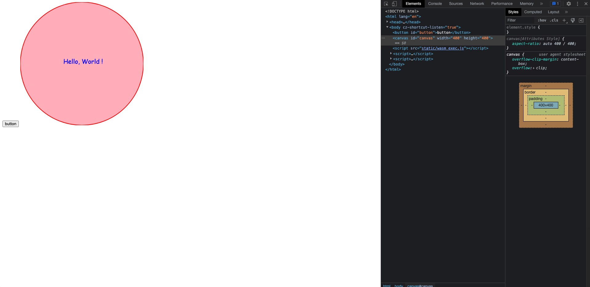

## 一. 前言

[WebAssembly](https://developer.mozilla.org/zh-CN/docs/WebAssembly) 是一种新的编码方式，可以在现代的网络浏览器中运行 － 它是一种低级的类汇编语言，具有紧凑的二进制格式，可以接近原生的性能运行，并为诸如 C / C ++等语言提供一个编译目标，以便它们可以在 Web 上运行。它也被设计为可以与 JavaScript 共存，允许两者一起工作。


## 二. 快速上手

### 1. 用go写一个hello world

```go
package main

import (
	"fmt"
)

func main() {
	fmt.Println("Hello, WebAssembly!")
}
```

### 2. 将go文件编译成wasm文件

```shell
GOOS=js GOARCH=wasm go build -o static/main.wasm
```

### 3. 拷贝出wasm_exec.js

该文件为go的wasm的js支持文件

```shell
cp "$(go env GOROOT)/misc/wasm/wasm_exec.js" static
```

### 4. html文件调用wasm文件

```html
<script src="static/wasm_exec.js"></script>
<script>
  const go = new Go();
  WebAssembly.instantiateStreaming(fetch("static/main.wasm"), go.importObject)
    .then((result) => go.run(result.instance))
</script>
```

### 5. 验证调用

浏览器加载html文件，f12打开控制台，可以看到wasm的打印消息。


## 三. go与js的类型转换

### 1. 类型映射

```
| Go                     | JavaScript             |
| ---------------------- | ---------------------- |
| js.Value               | [its value]            |
| js.Func                | function               |
| nil                    | null                   |
| bool                   | boolean                |
| integers and floats    | number                 |
| string                 | string                 |
| []interface{}          | new array              |
| map[string]interface{} | new object             |
```

如上为官方给出的go与js的类型映射表。

比如在go中调用js函数，参数为`array`，那么就可以直接将go的`[]interface{}`类型的变量作为参数使用。

### 2. 函数转换数组

`syscall/js`提供了两个函数：

* CopyBytesToGo：`func CopyBytesToGo(dst []byte, src Value) int`
* CopyBytesToJS：`func CopyBytesToJS(dst Value, src []byte) int`

两者对于go而言，类型都是`[]byte`，但是对于js而言，需要`Uint8Array`或者`Uint8ClampedArray`类型，否则就会报错。

那么，如何在go中生成一个`Uint8Array`或者`Uint8ClampedArray`类型的变量呢？官方的类型映射表也没有啊...那么就看下一步。

### 3. 其余类型

对于非官方类型映射表内的类型，和官方提供的两个数据类型转换之外的类型，可以通过一种通用的方式来生成，以上一步的`Uint8Array`为例：

```js
js.Global().Get("Uint8Array").New(<length>)
```

实际使用案例：

```js
// goData []byte{...}
jsData := js.Global().Get("Uint8Array").New(len(goData))
js.CopyBytesToJS(jsData, goData)
```

那么，比如js中的`Date`类型：

```js
dateConstructor := js.Global().Get("Date")
dateConstructor.New("2020-10-01")
```

### 4. 极端情况

好吧，还有最后一个方案，如果遇到极端情况，上述方案都无法解决，那么请转换成字符串吧！让go和js用各自的方法分别处理一波，得到自己想要的结果或者给出各自想给的数据。


## 四. js调用go函数

> 此处需要在go中引入[syscall/js](https://pkg.go.dev/syscall/js)，以实现js相关的操作。
>

### 1. 注册go函数

将go的函数注册为js的函数，由js来进行调用。

```go
package main

import "syscall/js"

func handleCount(this js.Value, args []js.Value) interface{} {
  count := args[0].Int()
  return js.ValueOf(count + 1)
}

func main() {
	done := make(chan string, 0)
	js.Global().Set("HandleEvent", js.FuncOf(handleEvent))
	<-done
}
```

`js.Func()` 接受一个函数类型作为其参数，该函数的定义是固定的：

```go
func(this Value, args []Value) interface{}
// this 即 JavaScript 中的 this
// args 是在 JavaScript 中调用该函数的参数列表。
// 返回值需用 js.ValueOf 映射成 JavaScript 的值
```

js.ValueOf返回作为js的值：

```
| Go                     | JavaScript             |
| ---------------------- | ---------------------- |
| js.Value               | [its value]            |
| js.Func                | function               |
| nil                    | null                   |
| bool                   | boolean                |
| integers and floats    | number                 |
| string                 | string                 |
| []interface{}          | new array              |
| map[string]interface{} | new object             |
```

### 2. js调用

在js中使用也非常简单，引入wasm文件之后，直接调用函数即可。

```html
<script src="static/wasm_exec.js"></script>
<script>
  const go = new Go();
  WebAssembly.instantiateStreaming(fetch("static/main.wasm"), go.importObject)
    .then((result) => go.run(result.instance))
</script>
<script>
	document.querySelector('#button').addEventListener('click', () => {
  	HandleEvent(1) // 传入参数1
	})
</script>
```


## 五. go调用js函数

如果在js中本身已经定义了函数，那么在go中也可以直接调用该函数，进行运算，将得出的结果在go中继续使用。

### 1. 定义js函数

```html
<script>
    function add(m, n) {
        return m + n
    }
</script>
```

### 2. go中调用js函数

```go
package main

import (
	"fmt"
	"syscall/js"
)

func main() {
	result := js.Global().Call("add", 1, 2)
	fmt.Println(result) // 此处输出类型为js.Value，无法直接使用
  fmt.Println(result.Int() + 1) // 使用.Int()将其转换为go中的类型，即可直接使用
}
```

### 3. 引入wasm

```html
<script>
    function add(m, n) {
        return m + n
    }
</script>
<script src="static/wasm_exec.js"></script>
<script>
    const go = new Go();
    WebAssembly.instantiateStreaming(fetch("static/main.wasm"), go.importObject)
        .then((result) => go.run(result.instance))
</script>
```

### 4. 结果

在前端调试台可以看到输出：

```
<number: 3>
4
```

第一个结果就是js.Value的值，第二个结果则是转换成go的值，并按照逻辑进行了`+1`处理。


## 六. 回调函数/解决go函数阻塞问题

> The Go function fn is called with the value of JavaScript's "this" keyword and the arguments of the invocation. The return value of the invocation is the result of the Go function mapped back to JavaScript according to ValueOf.
>
> Invoking the wrapped Go function from JavaScript will pause the event loop and spawn a new goroutine. Other wrapped functions which are triggered during a call from Go to JavaScript get executed on the same goroutine.
>
> As a consequence, if one wrapped function blocks, JavaScript's event loop is blocked until that function returns. Hence, calling any async JavaScript API, which requires the event loop, like fetch (http.Client), will cause an immediate deadlock. Therefore a blocking function should explicitly start a new goroutine.

`syscall/js`官方文档表明，如果go包装函数阻塞，那么js的事件循环也将被阻塞，直到函数返回，调用任何需要事件循环（如fetch）的异步js api都导致立即死锁。因此，一个阻塞函数应该显式地启动一个新的协程。

此处，可以在go中注册一个回调函数，加上协程实现异步，不会产生堵塞。

### 1. 注册函数

```go
package main

import (
	"fmt"
	"syscall/js"
	"time"
)

func handleRender(this js.Value, args []js.Value) interface{} {
	username := args[0].String()
	callback := args[len(args)-1]

	go func() {
		time.Sleep(3 * time.Second)
		callback.Invoke(fmt.Sprintf("hello, %s !", username))
	}()

	fmt.Println("waiting...")
	return nil
}

func main() {
	done := make(chan string, 0)
	js.Global().Set("HandleRender", js.FuncOf(handleRender))
	<-done
}
```

### 2. js调用

```html
<script src="static/wasm_exec.js"></script>
<script>
    const go = new Go();
    WebAssembly.instantiateStreaming(fetch("static/main.wasm"), go.importObject)
        .then((result) => go.run(result.instance))
</script>
<script>
    document.querySelector('#button').addEventListener('click', () => {
        HandleRender("tom", (message) => console.log('message: ', message))
    })
</script>
```

### 3. 输出

在浏览器调试台，可以看到：

```
waiting... // 先输出了waiting...
hello, tom ! // 隔了3秒之后，输出了回调函数的值
```


## 七. Go实现Promise

上一步的回调函数，解决了函数阻塞问题，此处，结合回调函数实现promise，来丰富异步场景。

在js中，promise是这样的：

```js
const message = new Promise((resolve, reject) => {
    setTimeout(() => {
        resolve("hello, world !")
    }, 3000)
})
```

使用`async`和`await`调用，拿到结果：

```js
async function printMessage() {
    const message = new Promise((resolve, reject) => {
        setTimeout(() => {
            resolve("hello, world !")
        }, 3000)
    })

    const result = await message
    console.log(result)
}
```

在go中又如何构建promise呢？这里可以用到上述go与js的类型转换，创建一个promise：

```go
js.Global().Get("Promise")
```

### 1. 注册函数

go的完整实现如下：

```go
package main

import (
	"fmt"
	"syscall/js"
	"time"
)

var document = js.Global().Get("document")

func handleRender(this js.Value, args []js.Value) interface{} {

	handler := js.FuncOf(func(this js.Value, args []js.Value) interface{} {

		resolve := args[0]

		go func() {
			time.Sleep(3 * time.Second)
			resolve.Invoke("hello, world !")
		}()

		fmt.Println("waiting...")
		return nil
	})

	promiseConstructor := js.Global().Get("Promise")
	return promiseConstructor.New(handler)
}

func main() {
	done := make(chan string, 0)
	js.Global().Set("HandleRender", js.FuncOf(handleRender))
	<-done
}
```

### 2. js调用

```html
<script src="static/wasm_exec.js"></script>
<script>
    const go = new Go();
    WebAssembly.instantiateStreaming(fetch("static/main.wasm"), go.importObject)
        .then((result) => go.run(result.instance))
</script>
<script>
    document.querySelector('#button').addEventListener('click', async () => {
        const message = await HandleRender()
        console.log('message: ', message)
    })
</script>
```

### 3. 输出

在浏览器调试台，可以看到：

```
waiting... // 先输出了waiting...
message:  hello, world ! // 隔了3秒之后输出
```


## 八. 操作DOM

### 使用document

定义一个全局的document

```
var docuemnt = js.Global().Get("document")
```

### 获取元素

获取一个`id`为`container`的`div`，设置`background-color: red`、`widht: 600`、`height: 400`

```go
var containerElement = document.Call("getElementById", "container")
var containerElementStyle = container.Get("style")
containerElementStyle.Set("background", "red")
containerElementStyle.Set("width", "600px")
containerElementStyle.Set("height", "400px")
```

### 创建元素

创建一个`id`为`image`的`image`，设置`width:300`、`height:200`

```go
var imageElement = document.Call("createElement", "canvas")
imageElement.Set("width", 300)
imageElement.Set("width", 200)
```

### 添加子元素

将`image`添加为`id`为`container`的`div`的子元素

```go
containerElement.Call("appendChild", imageElement)
```

### 添加事件

给`image`添加右击事件，右击`image`则阻止右键菜单

```go
// 定义响应函数
func handlePreventEventCallBack(this js.Value, args []js.Value) interface{} {
	args[0].Call("preventDefault")
	return false
}

// 给image添加事件
imageElement.Call("addEventListener", "contextmenu", js.FuncOf(handlePreventEventCallBack))
```

这里需要注意的是，当不再调用响应事件函数时，必须调用Func.Release以释放资源：

```go
var cb js.Func
cb = js.FuncOf(func(this js.Value, args []js.Value) any {
	fmt.Println("button clicked")
	cb.Release() // 如果不再单击该按钮，则释放该函数
	return nil
})
js.Global().Get("document").Call("getElementById", "myButton").Call("addEventListener", "click", cb)
```


## 九. Canvas

这里放一波canvas的案例，包含了一些常用方法，可以参考完成更多操作。

```go
package main

import (
	"math"
	"syscall/js"
)

const (
	width  = 400
	height = 400
	radius = 200
)

var document = js.Global().Get("document")

func handleRender(this js.Value, args []js.Value) interface{} {
	var canvas = document.Call("getElementById", "canvas")
	canvas.Set("width", width)
	canvas.Set("height", height)

	var ctx = canvas.Call("getContext", "2d")

	ctx.Call("beginPath")
	ctx.Call("arc", width/2, height/2, radius, 0, 2*math.Pi)
	ctx.Set("fillStyle", "lightpink")
	ctx.Call("fill")
	ctx.Set("lineWidth", 2)
	ctx.Set("strokeStyle", "red")
	ctx.Call("stroke")

	ctx.Set("font", "20px Comic Sans MS")
	ctx.Set("fillStyle", "blue")
	ctx.Call("fillText", "Hello, World !", width/2-60, height/2)

	return nil
}

func main() {
	done := make(chan string, 0)
	js.Global().Set("HandleRender", js.FuncOf(handleRender))
	<-done
}
```

渲染结果：




## 十. 参考文档

* [syscall/js](https://pkg.go.dev/syscall/js)
* [go wiki WebAssembly](https://github.com/golang/go/wiki/WebAssembly)
* [Go WebAssembly (Wasm) 简明教程](https://geektutu.com/post/quick-go-wasm.html)
* [Go, WebAssembly, HTTP requests and Promises](https://withblue.ink/2020/10/03/go-webassembly-http-requests-and-promises.html)


