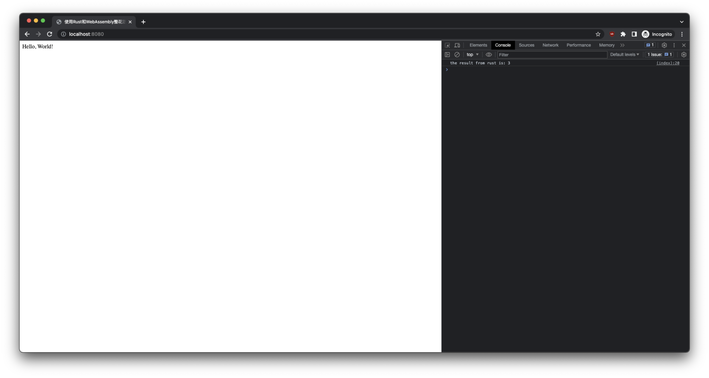

# 一. 前言

[WebAssembly](https://developer.mozilla.org/zh-CN/docs/WebAssembly) 是一种新的编码方式，可以在现代的网络浏览器中运行 － 它是一种低级的类汇编语言，具有紧凑的二进制格式，可以接近原生的性能运行，并为诸如 C / C ++等语言提供一个编译目标，以便它们可以在 Web 上运行。它也被设计为可以与 JavaScript 共存，允许两者一起工作。


之前写过一篇文章，是关于如何使用golang来开发WebAssembly的——[WebAssembly：未来前端开发的必备技能](https://github.com/Kuari/Blog/issues/69)。

Rust和Go都可以用来开发WebAssembly，但它们有各自的优势和劣势。

Rust的优点：

- 更快的性能和更小的二进制文件
- 更好的内存安全性

Go的优点：

- 更容易上手和学习
- 更好的生态系统和社区支持

综合来说，如果你更注重性能和内存安全性，那么Rust可能是更好的选择。而如果你更注重开发效率和易用性，那么Go可能更适合你。当然，实际情况还需要根据具体的项目需求和团队情况来选择。

因为一些工作需求，最近整了些rust的花活儿，这里系统地记录一下。当你遇到更注重性能和内存安全性的场景，希望这能有帮助。


# 二. 环境

- Rust 1.70.0
- wasm-bindgen 0.2.87


# 三. 创建项目并添加依赖

此处默认已经安装Rust，需要安装的小伙伴儿可以参考[官网](https://www.rust-lang.org/tools/install)。

使用Cargo创建一个名为`hello-wasm`的项目：

```bash
cargo new --lib hello-wasm
```

进入项目，打开文件`Cargo.toml`，添加依赖：

```toml
[lib]
crate-type = ["cdylib"]

[dependencies]
wasm-bindgen = "0.2.87"
```


# 四. 更新lib.rs

默认创建项目中，存在一个名为`lib.rs`的文件，将内容全部替换成：

```rust
use wasm_bindgen::prelude::*;

#[wasm_bindgen]
pub fn add(a: i32, b: i32) -> i32 {
  a + b
}
```


# 五. 编译

至此，我们创建了一个最简单的功能——一个返回两个整数相加结果的函数。

然后我们可以进行编译了，编译之前需要安装一个工具`wasm-pack`：

```bash
cargo install wasm-pack
```

然后进行编译：

```bash
wasm-pack build --target web
```

编译完成之后，将会多出来一个`pkg`文件夹，内容如下：

```bash
pkg
├── hello_wasm.d.ts
├── hello_wasm.js
├── hello_wasm_bg.wasm
├── hello_wasm_bg.wasm.d.ts
└── package.json
```

虽然文件很多，但是首先我们看到了我们所需要的wasm文件，并且，根据go的wasm引入方式，这里我们或许会需要用到js文件。


# 六. 前端引入

为了方便最快校验，直接在`hello-wasm`项目中创建`index.html`文件，来进行前端引入。

### 1. 创建index.html

那么，首先，创建`index.html`文件：

```html
<!DOCTYPE html>
<html lang="en">

<head>
    <meta charset="UTF-8">
    <meta name="viewport" content="width=device-width, initial-scale=1.0">
    <title>使用Rust和WebAssembly整花活儿</title>
</head>

<body>
    Hello, World!
</body>

</html>
```

是的，没错！这是一场标准的开局！😼

### 2. 引入WASM

其实不同于go语言的wasm引入方式，Rust更希望直接引入js文件，而不是让开发者手动引入wasm文件。

这里使用js引入：

```html
<script type="module">
    import init, { add } from './pkg/hello_wasm.js';

    const run = async () => {
        await init();
        const result = add(1, 2);
        console.log(`the result from rust is: ${result}`);
    }

    run();
</script>
```

### 3. 完整代码

完整的html代码如下：

```html
<!DOCTYPE html>
<html lang="en">

<head>
    <meta charset="UTF-8">
    <meta name="viewport" content="width=device-width, initial-scale=1.0">
    <title>使用Rust和WebAssembly整花活儿</title>
</head>

<body>
    Hello, World!
</body>

<script type="module">
    import init, { add } from './pkg/hello_wasm.js';

    const run = async () => {
        await init();
        const result = add(1, 2);
        console.log(`the result from rust is: ${result}`);
    }

    run();
</script>

</html>
```


# 七. 验证

这里可以快速起一个http server，这里我选择使用`http-server`，也可以使用`python3 -m http.server`这样的方式，看怎么各自的使用习惯。

那么，启动http server：

```html
http-server
```

打开浏览器，访问`http://localhost:8080`，打开调试器，即可看到输出`the result from rust is: 3`，这就意味着迈出了整花活儿的第一步！




# 八. 常见问题

### 1. 前端报响应类型错误

详细报错如下：

```
Failed to load module script: The server responded with a non-JavaScript MIME type of "application/wasm". Strict MIME type checking is enforced for module scripts per HTML spec.
```

当引入WebAssembly生成的js文件时，可能会遇到这个报错。报错乍一看是http server的响应问题，或者搜索时候，也会有帖子说这是一个response问题。

实际上，当按照这个文章一步步操作时是不会有这个问题的，是因为本文的编译参数是直接解决了这个问题的。当我自己摸索的时候，解决这个问题真的是看到人都麻了……

关键在于编译命令的参数：`--target`。

当没有设置这个参数时，默认的参数其实是`--target bundler`，其是编译成给webpack之类的脚手架使用的。因此这里使用`—target web`，则是使其编译成可直接在web中使用。

相关参数如下：

- **bundler**：编译成给webpack之类的脚手架使用
- **web**：编译成web可直接使用
- **nodejs**：编译成可通过require来加载的node模块
- **deno**：编译成可通过import加载的deno模块
- **no-modules**：跟web类似，但是更旧，且不能使用es模块


### 2. 直接引入wasm文件

若此时尝试直接引入wasm文件，而不是使用本文所述的方式，那么你会发现，也是可行的！

```html
<script type="module">
    WebAssembly.instantiateStreaming(fetch("./pkg/hello_wasm_bg.wasm"), {}).then(
        (obj) => console.log('the result from rust is: ', obj.instance.exports.add(1, 2))
    );
</script>
```

是的，没错，当前是可行的，但是当引入了一些别的比如dom之类的，就坏起来了……


### 3. 更新的wasm引入方式

上一问题中，且不说是否可以直接引入wasm文件，这里仅说一下，`instantiateStreaming`这个方法。这是一个更新的方法，无需转成`arrayBuffer`，这也是摸索Rust整活儿时候发现的。如果在别的语言引入wasm，请使用这个[更新的方法](https://developer.mozilla.org/en-US/docs/WebAssembly/JavaScript_interface/instantiateStreaming)吧。