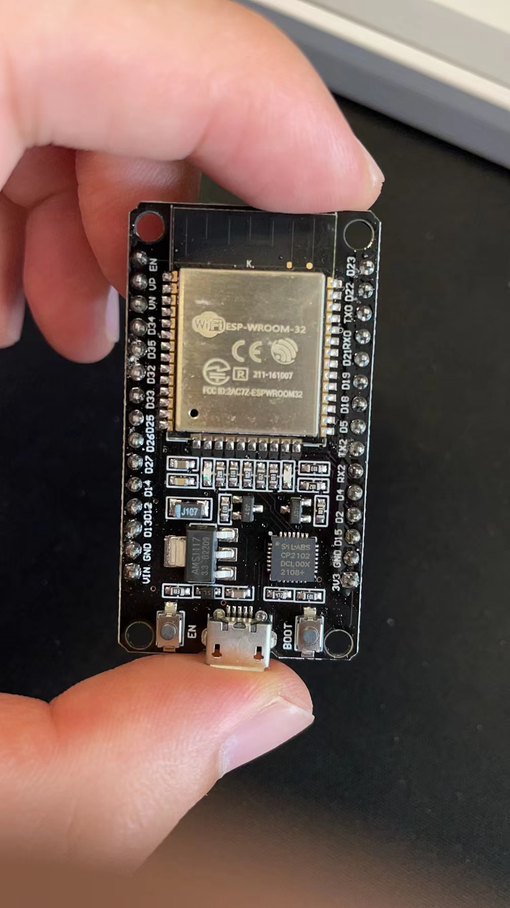
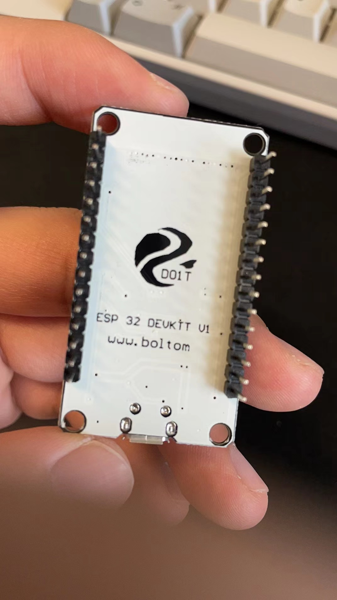
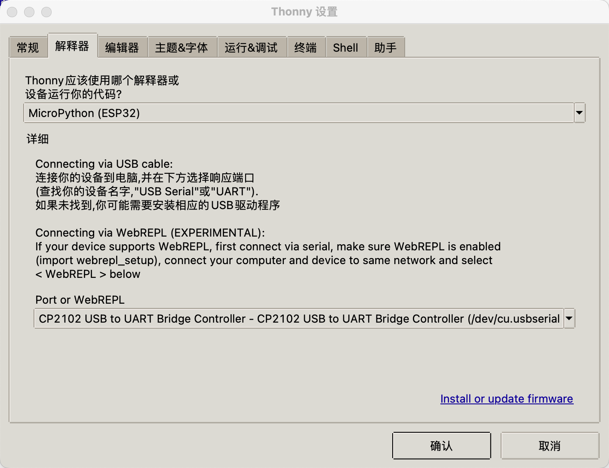
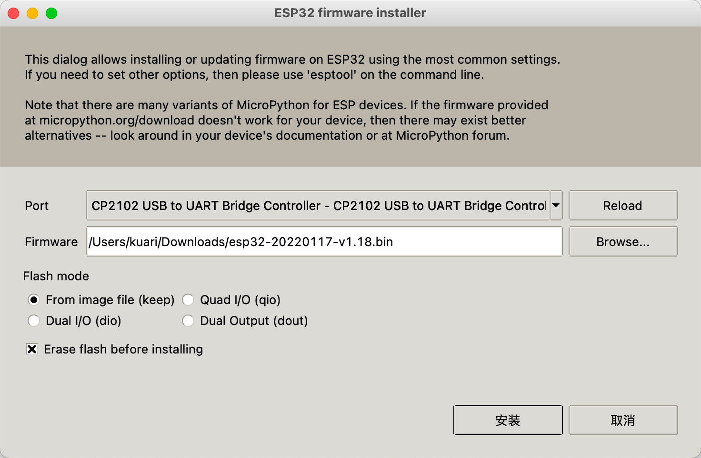

## 一. 前言

买了两块ESP32来玩玩，写点笔记记录一波。目前主要是以`microPython`来开发，先用python踩踩坑。

<p align="center">
  
  
</p>


## 二. 环境

* 操作系统：macOS Monterey 12.3.1
* Thonny：3.3.13


## 三. 安装IDE

下载地址：[thonny.com](https://thonny.org/)

由于是esp32的microPython，不能用传统的IDE开发，此处使用的是`thonny`这个python ide。该IDE集成了连接esp32单片机、刷固件和写入文件等功能，比较方便。

在网页上选择Mac安装包，我下载时候，当前的版本是`3.3.13`。下载完成之后，将其安装。


## 四. 下载固件

下载地址：[microPython esp32 固件下载](https://micropython.org/download/esp32/)

在`Firmware`栏目中，选择最新版本的`.bin`文件下载即可。

在该页面上，还有一处教程，该教程是教大家如果使用python的`esptool`在命令行进行烧录固件，有兴趣的小伙伴儿可以去试一试。


## 五. 烧录固件

### 1. 连接esp32和mac

首先使用数据线连接esp32板子和mac，可以看到esp32亮起红灯。

### 2. 安装USB驱动

打开之前下载的thonny程序，在菜单上找到`运行`选项，选择其菜单第一行`选择解释器...`。（选项就是这么写的，带一个省略号...）



如图所示，第一个选择框内选择`MicroPtyhone(ESP32)`。

第二个选择框，选择esp32板子连接的端口。如果你不知道哪个是你的esp32板子的连接的端口，你可以使用如下方式去判断：

* 关闭ide，拔掉esp32，然后再打开ide，进去这个设置，注意选项。接着连接esp32，关闭设置后再打开，多出来的选项就是esp32连接的端口

最后点击确定，进行安装USB驱动程序。

安装成功之后，每次打开会在IDE的下方Shell中输出一些连接信息。

### 3. 烧录固件

按照上一步骤，再次打开该`选择解释器...`，点击右下角蓝色的`Install or update firmware`，打开新的弹窗。



如上图所示，烧录固件设置页面。

首先在`Port`中选esp32板子连接的端口，跟上一步骤一样。

接着在`Firmware`中选择我们下载的固件文件。

然后下面的选项默认都是选上的，全都不要动，直接点击`安装`按钮。

点击完成后，就可以看到左下角有安装进度，点击安装进度的蓝色文字，会在弹窗最小方弹出安装进度。

等到安装进度最后输出`Done`，即为安装成功！


## 六. 测试

重启一下IDE，在Shell中写一个`print('Hello, World!')`，回车即可运行。

在菜单中，选择`视图`->`文件`，即可打开文件树，可以在文件树下方看到`MicreoPython设备`窗口，内有esp32板子里面的python文件。


## 七. 问题记录

### 1. 烧录固件报错

#### 报错内容：

```shell
A fatal error occurred: Failed to connect to Espressif device: Timed out waiting for packet header
```

#### 解决方案：

在开始烧录后，注意查看烧录日志，在开始烧录时候摁住esp32板子上的`boot`按键，知道下一步再松开。

#### 解决过程：

一开始直接谷歌搜索，查出来基本都是要在esp32板子上接一个电容，瞬间我就感觉：这玩意儿对新手这么不友好的吗？！后来想想毕竟国产的esp32，到baidu上查一查，然后就找到了这个解决方案，也确实解决了我的问题。妙啊！